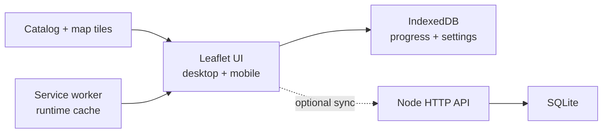

<div align="center">
  

  <h1>Wuthering Waves Wayfinder</h1>

  <p><strong>Bản đồ tiến trình local-first dành cho Rover thích vét sạch từng chiếc rương.</strong></p>
  <p>Không cần tài khoản KURO · Chạy tốt trên mobile · Có thể host riêng</p>

  <p>
    <a href="https://accel.io.vn/wuwa-map/"><strong>🗺️ Mở bản đồ</strong></a>
    ·
    <a href="./README_EN.md">English</a>
    ·
    <a href="./deploy/STATIC_HOSTING.md">Deploy static</a>
    ·
    <a href="./deploy/README.md">Deploy full-stack</a>
  </p>

  <p>
    
    
    
    
  </p>

  <p>
    
    
    
    
    
  </p>
</div>

---

> Mở map, chọn khu vực và tầng, click marker đã nhặt — Wayfinder tự nhớ phần
> còn lại. Nếu backend tạm mất kết nối, tiến trình vẫn được ghi trên thiết bị
> và đồng bộ lại khi mạng quay về.

## Có gì trong map?

| | Tính năng |
| --- | --- |
| 🗺️ | Bản đồ tile nhiều khu vực, pan/zoom mượt bằng Leaflet |
| 🧭 | Chuyển khu vực và tầng bản đồ trên cả desktop lẫn mobile |
| ✅ | Đánh dấu hoặc hoàn tác điểm đã nhặt, kèm tổng tiến trình theo thời gian thực |
| 🔎 | Tìm theo tên/ID, lọc danh mục và ẩn điểm đã hoàn thành |
| 🇻🇳 | Giao diện cùng dữ liệu map được Việt hóa và lưu sẵn trong bundle |
| 💾 | IndexedDB lưu progress, profile, setting và map pack ngay trên trình duyệt |
| 📦 | Export/import JSON để backup hoặc chuyển tiến trình sang máy khác |
| 📴 | Local-only fallback khi không có backend; PWA runtime cache cho production |
| 🔐 | Backend Node + SQLite tùy chọn với one-time invite và session dài hạn |
| 🧩 | Import map pack riêng có validation, không khóa vào một nguồn dữ liệu |

## Snapshot dữ liệu

Bundle hiện tại được tạo từ dữ liệu map công khai và được Việt hóa theo hướng
community-maintained.

| Khu vực | Marker | Danh mục | Tầng |
| --- | ---: | ---: | ---: |
| Băng nguyên Roya | 2.530 | 74 | 23 |
| Hoàng Long | 8.761 | 184 | 8 |
| Hoàng Long 2 | 1.478 | 49 | 7 |
| Quần đảo Bờ Đen | 352 | 40 | 0 |
| Rinascita | 6.953 | 184 | 16 |
| Vực sâu Tethys | 415 | 40 | 5 |
| Kho bạc ngầm | 231 | 37 | 10 |
| Avinoleum | 454 | 31 | 0 |
| Bãi thử Biển Ẩn | 236 | 35 | 1 |
| Đồng bằng Dimmr | 673 | 43 | 7 |
| Đô thị Chronorift | 59 | 9 | 0 |
| **Tổng** | **22.142** | **726** | **77** |

> Số liệu trên phản ánh bundle hiện đang được commit trong repository và có thể
> thay đổi sau những lần cập nhật dữ liệu tiếp theo.

## Chọn chế độ phù hợp

| | Static hosting | Node + SQLite |
| --- | --- | --- |
| Phù hợp với | Một người, một browser chính | Nhiều thiết bị hoặc hai profile |
| Lưu tiến trình | IndexedDB | IndexedDB + SQLite |
| Đăng nhập | Không cần | One-time invite |
| Offline | Tiến trình vẫn lưu local | Local trước, đồng bộ lại sau |
| Chuyển thiết bị | Export/import JSON | Đồng bộ qua backend |
| Độ khó deploy | Rất thấp | Cần Node, HTTPS và storage bền |

Nếu chỉ đưa map cho một người bạn dùng trên một thiết bị, **static hosting là đủ**.
Xem hướng dẫn tại [`deploy/STATIC_HOSTING.md`](deploy/STATIC_HOSTING.md).

## Chạy local

Yêu cầu:

- Node.js 24 trở lên.
- pnpm 11.

```bash
git clone https://github.com/Acceleratorer/wuwa-map.git
cd wuwa-map
corepack enable
pnpm install --frozen-lockfile
pnpm dev
```

Mở:

```text
http://127.0.0.1:5173/wuwa-map/
```

Frontend tự chạy ở local-only mode nếu API chưa được bật.

### Chạy full-stack

Copy cấu hình mẫu:

```powershell
Copy-Item .env.example .env
```

Chạy hai terminal:

```bash
# Terminal 1
pnpm dev:api

# Terminal 2
pnpm dev
```

Tạo link invite một lần cho profile `friend`, hết hạn sau 72 giờ:

```bash
pnpm invite friend 72
```

Người dùng chỉ cần mở link được tạo một lần. Session mặc định tồn tại 3650 ngày,
trừ khi bị thu hồi, đăng xuất hoặc dữ liệu trình duyệt bị xóa.

## Kiến trúc



- Mọi thao tác progress được ghi local trước để UI phản hồi ngay.
- API là tùy chọn; frontend tự fallback nếu backend không khả dụng.
- Map được tách thành catalog và từng pack để lazy-load theo khu vực.
- Floor overlay chỉ tải khi người dùng chọn tầng tương ứng.

## Các lệnh chính

| Lệnh | Công dụng |
| --- | --- |
| `pnpm dev` | Chạy Vite dev server |
| `pnpm dev:api` | Chạy Node API ở watch mode |
| `pnpm build` | Type-check và build production |
| `pnpm serve` | Chạy production server |
| `pnpm test` | Chạy server tests, tool tests và production build |
| `pnpm invite friend 72` | Tạo one-time invite |
| `pnpm devices list` | Liệt kê thiết bị đã liên kết |
| `pnpm devices revoke <id>` | Thu hồi một session |
| `pnpm backup` | Tạo SQLite snapshot và chạy integrity check |
| `pnpm crawl:kuro --help` | Xem tùy chọn crawler |
| `pnpm translate:kuro --help` | Xem tùy chọn pipeline Việt hóa |

## Cập nhật dữ liệu map

Chỉ chạy crawler khi bạn có quyền phù hợp với nguồn dữ liệu:

```bash
pnpm crawl:kuro --output public/map-packs/private --states all
```

Áp cache Việt hóa vào bundle sau khi crawl:

```bash
pnpm translate:kuro \
  --input public/map-packs/private \
  --include-descriptions true \
  --apply true
```

Crawler không dùng cookie hoặc tài khoản KURO, không gọi API ghi tiến trình và
không đưa logic dịch vào runtime. Ứng dụng production chỉ đọc JSON đã được xử lý
trước. Xem thêm tại [`public/map-packs/private/NOTICE.md`](public/map-packs/private/NOTICE.md).

## Cấu trúc repository

```text
src/                         Leaflet UI, IndexedDB và sync client
server/                      Node HTTP API, SQLite, invite và backup
tools/                       Crawler, converter và pipeline Việt hóa
public/map-packs/private/    Catalog, marker, icon và tile deploy-ready
deploy/                      Hướng dẫn Nginx, systemd và static hosting
userscripts/                 Userscript lưu progress trên map KURO
```

## Bảo mật và dữ liệu

Backend hiện có:

- Opaque session token; database chỉ lưu SHA-256 của token.
- Cookie `HttpOnly`, `SameSite=Strict` và `Secure` trên production.
- One-time invite, origin validation, rate limiting và request body limit.
- Parameterized SQLite queries và phân tách progress theo profile.
- CLI backup không ghi đè file cũ và chạy `PRAGMA quick_check`.

Không commit `.env`, database SQLite, WAL/SHM, raw crawl cache hoặc credential.

## Credit, quyền sử dụng và tuyên bố miễn trừ

Đây là **fan project không chính thức**, không được vận hành hoặc chứng thực bởi
KURO GAMES.

- **KURO GAMES** sở hữu Wuthering Waves cùng dữ liệu, hình ảnh, icon và tài sản
  game gốc.
- Bundle hiện tại phục vụ theo dõi tiến trình cá nhân, phi thương mại. Cơ sở
  permission do chủ repository công bố được ghi tại
  [`NOTICE.md`](public/map-packs/private/NOTICE.md).
- Bản dịch tiếng Việt là bản dịch cộng đồng có hỗ trợ máy và chỉnh sửa thủ công,
  không phải bản địa hóa chính thức từ KURO.
- [`9268/wuwa-map`](https://github.com/9268/wuwa-map) được credit cho phần nghiên
  cứu/pipeline dữ liệu trước đó. Giấy phép MIT của repository đó không tái cấp
  phép tài sản thuộc KURO.
- Leaflet, Vite, TypeScript và các dependency khác thuộc giấy phép riêng của
  từng dự án.

Repository hiện chưa có file `LICENSE` ở root, vì vậy README này không tự cấp
quyền sử dụng lại source code. Dữ liệu và tài sản bên thứ ba luôn tuân theo quyền
của chủ sở hữu tương ứng.

## Kiểm thử

```bash
pnpm test
```

Test suite bao gồm luồng invite/session, phân quyền profile, origin/input
validation, database maintenance, crawler/converter, pipeline Việt hóa,
TypeScript và production build.

---

<div align="center">
  <strong>Made for two Rovers who refuse to leave a chest behind.</strong>
  <br />
  <sub>Wayfinder by Accelra · Personal, local-first, non-commercial</sub>
</div>
