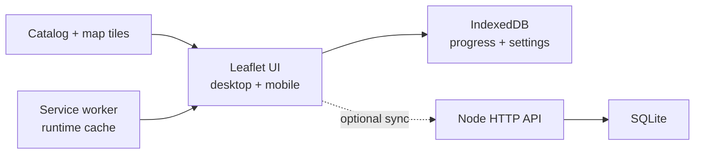

<div align="center">
  

  <h1>Wuthering Waves Wayfinder</h1>

  <p><strong>A local-first progress map for Rovers who refuse to leave a chest behind.</strong></p>
  <p>No KURO account required · Mobile friendly · Self-hostable</p>

  <p>
    <a href="https://accel.io.vn/wuwa-map/"><strong>🗺️ Open the map</strong></a>
    ·
    <a href="./README.md">Tiếng Việt</a>
    ·
    <a href="./deploy/STATIC_HOSTING.md">Static deployment</a>
    ·
    <a href="./deploy/README.md">Full-stack deployment</a>
  </p>

  <p>
    
    
    
    
  </p>

  <p>
    
    
    
    
    
  </p>
</div>

---

> Open the map, choose a region and floor, then click each collected marker.
> Wayfinder remembers the rest. If the backend becomes unavailable, progress is
> still written locally and synchronized when the connection returns.

## What's inside?

| | Feature |
| --- | --- |
| 🗺️ | Multi-region tiled maps with smooth Leaflet pan and zoom |
| 🧭 | Region and floor switching on both desktop and mobile |
| ✅ | Toggle collected markers with live overall and per-category progress |
| 🔎 | Search by name/ID, filter categories, and hide completed markers |
| 🇻🇳 | Vietnamese UI and a pre-localized map data bundle |
| 💾 | IndexedDB storage for progress, profiles, settings, and map packs |
| 📦 | JSON export/import for backups and device migration |
| 📴 | Local-only fallback without a backend and PWA runtime caching |
| 🔐 | Optional Node + SQLite backend with one-time invites and long sessions |
| 🧩 | Validated custom map-pack imports without vendor lock-in |

## Data snapshot

The current bundle was generated from public map data and localized through a
community-maintained translation pipeline.

| Region | Markers | Categories | Floors |
| --- | ---: | ---: | ---: |
| Roya Frostlands | 2,530 | 74 | 23 |
| Huanglong, Black Shores, Rinascita, and Roya Frostlands | 19,179 | 429 | 44 |
| Tethys Deep | 415 | 40 | 5 |
| Underground Treasury | 231 | 37 | 10 |
| Avinoleum | 454 | 31 | 0 |
| Hidden Sea Proving Ground | 236 | 35 | 1 |
| Dimmr Plains | 673 | 43 | 7 |
| Chronorift Metropolis | 59 | 9 | 0 |
| **Total** | **23,777** | **698** | **90** |

> These numbers describe the generated bundle currently committed to this
> repository and may change after future data refreshes.

## Choose a deployment mode

| | Static hosting | Node + SQLite |
| --- | --- | --- |
| Best for | One person using one primary browser | Multiple devices or two profiles |
| Progress storage | IndexedDB | IndexedDB + SQLite |
| Sign-in | Not required | One-time invite |
| Offline behavior | Progress remains local | Local writes followed by synchronization |
| Device migration | JSON export/import | Backend synchronization |
| Deployment complexity | Very low | Requires Node, HTTPS, and persistent storage |

For a map shared with one friend on one device, **static hosting is enough**.
Follow [`deploy/STATIC_HOSTING.md`](deploy/STATIC_HOSTING.md).

## Local development

Requirements:

- Node.js 24 or newer.
- pnpm 11.

```bash
git clone https://github.com/Acceleratorer/wuwa-map.git
cd wuwa-map
corepack enable
pnpm install --frozen-lockfile
pnpm dev
```

Open:

```text
http://127.0.0.1:5173/wuwa-map/
```

The frontend automatically uses local-only mode when the API is not running.

### Full-stack development

Copy the example configuration:

```powershell
Copy-Item .env.example .env
```

Start two terminals:

```bash
# Terminal 1
pnpm dev:api

# Terminal 2
pnpm dev
```

Create a one-time invite for the `friend` profile that expires after 72 hours:

```bash
pnpm invite friend 72
```

The user opens the generated link once. Sessions last 3650 days by default
unless revoked, signed out, or removed with the browser's site data.

## Architecture



- Progress is written locally first for immediate UI feedback.
- The API is optional; the frontend falls back automatically when unavailable.
- Maps are split into a catalog and individual packs for lazy region loading.
- Floor overlays are loaded only when their corresponding floor is selected.

## Commands

| Command | Purpose |
| --- | --- |
| `pnpm dev` | Start the Vite development server |
| `pnpm dev:api` | Start the Node API in watch mode |
| `pnpm build` | Type-check and create a production build |
| `pnpm serve` | Start the production server |
| `pnpm test` | Run server tests, tool tests, and the production build |
| `pnpm invite friend 72` | Create a one-time invite |
| `pnpm devices list` | List linked devices |
| `pnpm devices revoke <id>` | Revoke one session |
| `pnpm backup` | Create and integrity-check a SQLite snapshot |
| `pnpm crawl:kuro --help` | Show crawler options |
| `pnpm translate:kuro --help` | Show localization pipeline options |

## Refreshing map data

Only run the crawler when you have the appropriate rights for the data source:

```bash
pnpm crawl:kuro --output public/map-packs/private --states all
```

Apply the Vietnamese translation cache after crawling:

```bash
pnpm translate:kuro \
  --input public/map-packs/private \
  --include-descriptions true \
  --apply true
```

The crawler does not use KURO cookies or accounts, does not call progress-write
APIs, and keeps translation logic outside the runtime application. Production
only reads preprocessed JSON. See
[`public/map-packs/private/NOTICE.md`](public/map-packs/private/NOTICE.md).

## Repository layout

```text
src/                         Leaflet UI, IndexedDB, and sync client
server/                      Node HTTP API, SQLite, invites, and backups
tools/                       Crawler, converters, and localization pipeline
public/map-packs/private/    Deploy-ready catalog, markers, icons, and tiles
deploy/                      Nginx, systemd, and static-hosting guides
userscripts/                 Local progress userscript for the KURO map
```

## Security and data handling

The optional backend provides:

- Opaque session tokens with only their SHA-256 hashes stored in the database.
- `HttpOnly`, `SameSite=Strict`, and production `Secure` cookies.
- One-time invites, origin validation, rate limiting, and request-size limits.
- Parameterized SQLite queries and profile-scoped progress access.
- Non-overwriting SQLite backups verified with `PRAGMA quick_check`.

Never commit `.env`, SQLite databases, WAL/SHM files, raw crawl caches, or
credentials.

## Credits, usage rights, and disclaimer

This is an **unofficial fan project**. It is not operated, endorsed, or
affiliated with KURO GAMES.

- **KURO GAMES** owns Wuthering Waves and its original map data, images, icons,
  and game assets.
- The current bundle is intended for personal, non-commercial progress
  tracking. The repository owner's stated permission basis is documented in
  [`NOTICE.md`](public/map-packs/private/NOTICE.md).
- Vietnamese labels are community-maintained machine translations with manual
  corrections, not an official KURO localization.
- [`9268/wuwa-map`](https://github.com/9268/wuwa-map) is credited for earlier
  data research and pipeline work. Its MIT license does not relicense
  KURO-owned assets.
- Leaflet, Vite, TypeScript, and other dependencies remain under their
  respective licenses.

This repository currently has no root `LICENSE` file, so this README does not
grant a general license to reuse the source code. Third-party data and assets
remain subject to their respective owners' rights.

## Verification

```bash
pnpm test
```

The test suite covers invite/session behavior, profile isolation, origin and
input validation, database maintenance, crawler/converter behavior, the
localization pipeline, TypeScript, and the production build.

---

<div align="center">
  <strong>Made for two Rovers who refuse to leave a chest behind.</strong>
  <br />
  <sub>Wayfinder by Accelra · Personal, local-first, non-commercial</sub>
</div>
